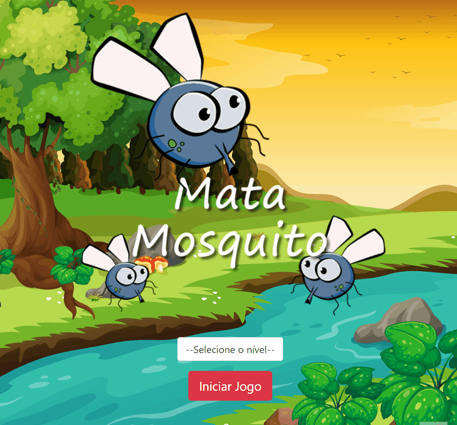

# 🪰Mata Mosquito Game

### Live site URL: https://evertonneto.github.io/Game_Mata_Mosquito-Udemy/

➡️Game desenvolvido com HTML,CSS e Javascript, todo o projeto foi feito baseado nas aulas do curso de web developer da Udemy.⬅️

## Tecnologias Utilizadas 💻

- HTML
- CSS e Bootstrap 5
- Javascript

## Como Utilizar/Jogar 🕹️

- Selecione uma dificuldade(Tempo de spawn aumenta de acordo com a dificuldade)

- Clique em Jogar

- Clique nos mosquitos antes de desaparecerem
